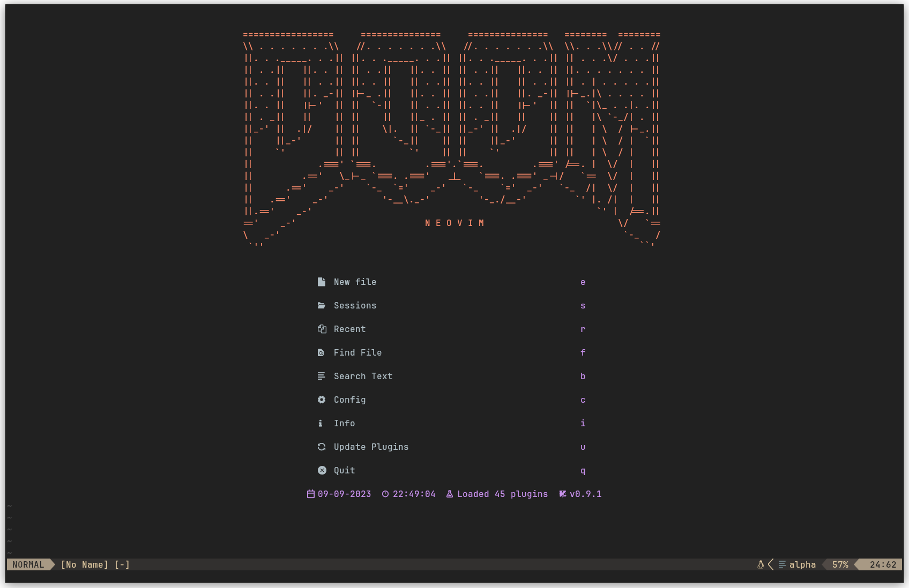

# Neovim Config

## Images



## Pre-requisites

You need to install certain packages to make sure that the config works
completely.

- **Install a Nerd Font:**

https://www.nerdfonts.com/

Recommended to use a true colour supported terminal such as kitty, alacritty etc

- **Python LSP Server**

Install python-lsp-server:
```bash
sudo apt install python3-pylsp
```
- **`nodejs` and `npm`**

Required to install certain LSPs from `mason.nvim`

Outdated version from Ubuntu 22.04 apt:
```bash
sudo apt install nodejs && npm
```

If you want an updated version, follow this: [NodeSource Node.js Binary Distributions](https://github.com/nodesource/distributions)

- **`ccls` (C/C++ LSP)**

I chose to use `ccls` over `clangd` for my C/C++ LSP as it works with PlatformIO.
```bash
sudo apt install ccls
```

- **Verilator**
```bash
sudo apt install verilator
```

- **Texlab**

I am using Texlab along with VimTex (installed via packer) for LaTeX LSP
Installation instructions: [texlab github](https://github.com/latex-lsp/texlab)

- **Zathura (PDF Viewer)**

**Optional**
VimTex can be configured to use any other PDF viewer such as Okular
```bash
sudo apt install zathura
```
- **LazyGit**

Used for git integration with NeoVim
Installation Instructions here: [lazygit github](https://github.com/jesseduffield/lazygit)

- **Dependancies for image.nvim**

This is a awesome plugin to enable image support for Neovim to use with
Markdown and Neorg.

In order for this plugin to work, install:
```bash
sudo apt install imagemagick
sudo apt install luarocks
sudo apt install curl
```
> Note: `curl` should be install out of the box
And use `luarocks` to install `magick`
```bash
luarocks install magick
```
More details can be found in the github page for the plugin: [image.nvim github](https://github.com/3rd/image.nvim)

- **Rust Language Auto-Formatting**

You will need to install `rustfmt` to do any code autoformatting with Rust.
This should be installed along with Rust by default. Just incase it is not:
```bash
rustup component add rustfmt
```

- **X11 Clipboard**

Just incase xclip isn't installed (wasn't for me):
```bash
sudo apt install xclip
```
I didn't have any clipboard issues on Wayland.

<!-- For debugger, check path -->

## TODO

- Cheat Sheet
- Finish README Page
- List of dependancies
- Neorg
- Rust Language LSP
- Copilot
- Debuggers
- Setup Script
